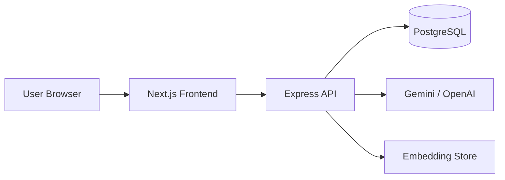

# AI ResumeIQ 🚀

**AI ResumeIQ** is a production-grade, full-stack AI platform for resume analysis, ATS optimization, job matching, cover letter generation, application tracking, and career coaching.

   

## Features

| Module | Capabilities |
|--------|-------------|
| **Auth** | Register, login, JWT sessions, Google OAuth (demo), forgot/reset password, RBAC (Admin/User) |
| **Dashboard** | ATS score, resume strength, skills, interview probability, charts |
| **Resume** | PDF/DOCX upload, NLP extraction, rule-based + AI ATS scoring |
| **Job Match** | Semantic similarity + AI keyword/missing skills analysis |
| **AI Improver** | Quantified bullet point rewrites |
| **Cover Letters** | Tone selection (professional/formal/casual) |
| **Tracker** | Kanban pipeline (Applied → Interview → Offer → Rejected) |
| **Career AI** | Conversational assistant with resume context |
| **Admin** | User management, token usage, processing logs |

## Architecture

```
Resume_analyzer/
├── frontend/          # Next.js 16, React 19, Tailwind 4, Framer Motion, ShadCN
├── backend/           # Express 5, Prisma 7, PostgreSQL
├── docs/              # API & deployment guides
└── docker-compose.yml # Full stack orchestration
```



## Quick Start

### Prerequisites

- Node.js 18+
- PostgreSQL (or Docker)

### 1. Database

```bash
docker compose up postgres -d
```

### 2. Backend

```bash
cd backend
cp .env.example .env
# Edit .env with DATABASE_URL and GEMINI_API_KEY
npm install
npx prisma generate
npx prisma db push
npx ts-node prisma/seed.ts
npm run dev
```

API runs at **http://localhost:8000**

### 3. Frontend

```bash
cd frontend
cp .env.local.example .env.local
npm install
npm run dev
```

App runs at **http://localhost:3000**

### Demo accounts (after seed)

| Role | Email | Password |
|------|-------|----------|
| Admin | admin@resumeiq.app | ResumeIQ2024! |
| User | demo@resumeiq.app | ResumeIQ2024! |

## Environment Variables

### Backend (`backend/.env`)

| Variable | Description |
|----------|-------------|
| `DATABASE_URL` | PostgreSQL connection string |
| `JWT_SECRET` | Secret for JWT signing |
| `GEMINI_API_KEY` | Google Gemini API key |
| `OPENAI_API_KEY` | OpenAI fallback |
| `FRONTEND_URL` | CORS origin |

### Frontend (`frontend/.env.local`)

| Variable | Description |
|----------|-------------|
| `NEXT_PUBLIC_API_URL` | Backend API URL |

## API Routes

See [docs/API.md](docs/API.md) for full REST documentation.

## Deployment

See [docs/DEPLOYMENT.md](docs/DEPLOYMENT.md) for Vercel + Render/Railway setup.

## Docker

```bash
docker compose up --build
```

## Tech Stack

- **Frontend:** Next.js, React, TypeScript, Tailwind CSS, Framer Motion, ShadCN UI, Recharts, Sonner
- **Backend:** Node.js, Express, Prisma, JWT, bcrypt, Helmet, rate limiting
- **AI:** Gemini 2.0 Flash / OpenAI GPT-4o-mini, embeddings, semantic search
- **Database:** PostgreSQL
- **DevOps:** Docker, docker-compose

## License

MIT
